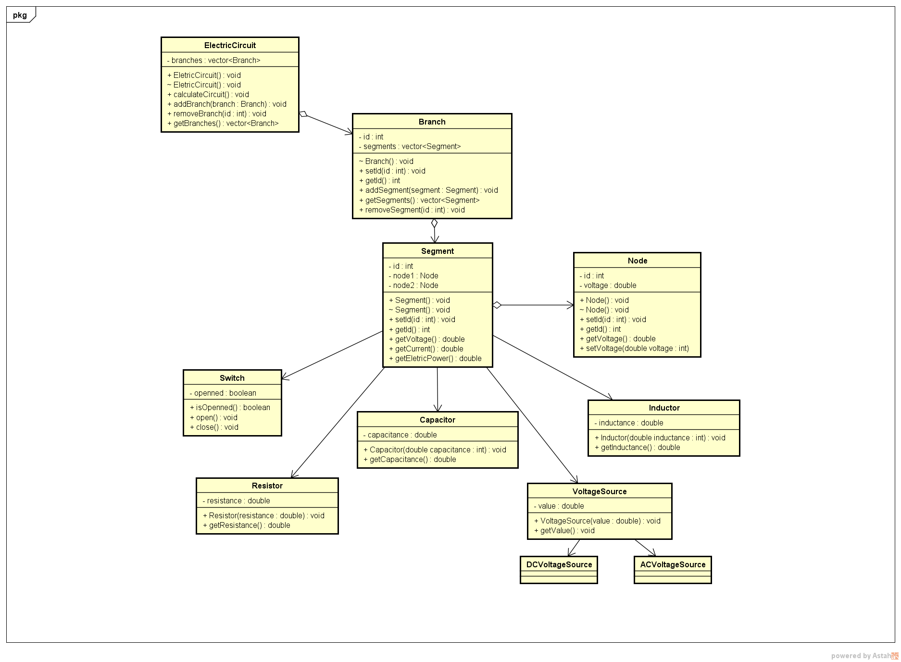

# Electric Circuit
> Academic Project - Subject: Object Oriented Programming

It is an application made to set and calculate values of an electric circuit.

## Classes Diagram

## Licensing

Released under the MIT license.